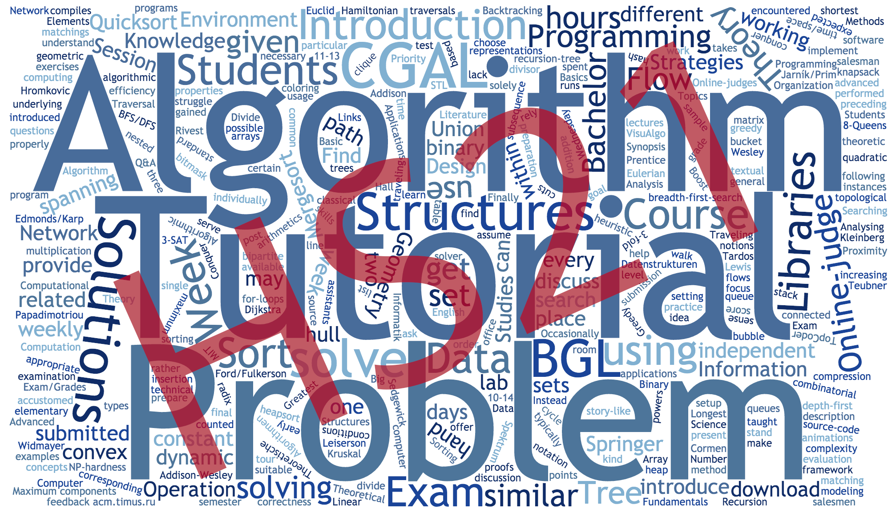

ETH Algorithms Lab HS2021
=========================

My solutions of ETH ~~Olympiad in Informatics~~ Algorithms Lab HS2021. 
Problems are summarized in the table below and explained with the header comments in source files.

In such a course, code quality is not the first priority. 
You may see bad coding styles in these files, 
such as inconsistent naming, bad indentation, untidy mixture of arrays and STL containers, etc.
It's not really my coding style. 
Instead, my idea is to copy-and-paste the provided tutorial sample code whenever possible,
and I would recommend you to do the same as well.

These files are intended to provide some inspiration if you get stuck on the problems and have
spent a reasonable amount of time. You should write the code on your own.
There is absolutely no guarantee or warranty for these files. Use them at your own risk and 
make sure to follow academic integrity regulations.
The problem descriptions are copyrighted by the ETH Algorithms Lab staff.

## Table of Problems

* BFS: breadth first search
* DAG: directed acyclic graph
* DFS: depth first search
* DP: dynamic programming
* SCC: strongly connected components

| Week                   | Subject                                                                                              | Score | Technique                                           |
| :--------------------- | :--------------------------------------------------------------------------------------------------- | :---- | :-------------------------------------------------- |
| [0](intro)             | Introduction                                                                                         | 100   | C++ basic                                           |
| [1](week1)             | [Build the Sum](week1/build_the_sum/build_the_sum.cpp)                                               | 100   | Simple iteration                                    |
| [1](week1)             | [Dominoes](week1/dominoes/dominoes.cpp)                                                              | 100   | Simple iteration                                    |
| [1](week1)             | [Even Pairs](week1/even_pairs/even_pairs.cpp)                                                        | 100   | Combination math                                    |
| [1](week1)             | [Even Matrices](week1/even_matrices/even_matrices.cpp)                                               | 100   | Combination math                                    |
| [PotW 2](potw2)        | [Deck of Cards](potw2/deck_of_cards.cpp)                                                             | 100   | Prefix sum + binary search, or sliding window       |
| [2](week2)             | [Burning Coins from Two Sides](week2/burning_coins/burning_coins.cpp)                                | 100   | DP                                                  |
| [2](week2)             | [Beach Bars](week2/beach_bars/beach_bars.cpp)                                                        | 100   | Simple iteration                                    |
| [2](week2)             | [The Great Game](week2/the_great_game/the_great_game.cpp)                                            | 100   | DP                                                  |
| [2](week2)             | [Defensive Line](week2/defensive_line/defensive_line.cpp)                                            | 100   | Sliding window + DP                                 |
| [PotW 3](potw3)        | [From Russia with Love](potw3/from_russia_with_love.cpp)                                             | 100   | DP                                                  |
| [3](week3)             | [Hit?](week3/hit/hit.cpp)                                                                            | 100   | CGAL intersection                                   |
| [3](week3)             | [First Hit](week3/first_hit/first_hit.cpp)                                                           | 100   | CGAL intersection + shrinking ray to segment        |
| [3](week3)             | [Antenna](week3/antenna/antenna.cpp)                                                                 | 100   | CGAL min circle                                     |
| [3](week3)             | [Hiking Maps](week3/hiking_maps/hiking_maps.cpp)                                                     | 100   | Sliding window + orientation test for inbound check |
| [PotW 4](potw4)        | [The Fighting Pits of Meereen](potw4/fighting_pits.cpp)                                              | 100   | DP                                                  |
| [4](week4)             | [First Steps with BGL](week4/first_step_with_bgl/first_step_with_bgl.cpp)                            | 100   | Minimal spanning tree                               |
| [4](week4)             | [Ant Challenge](week4/ant_challenge/ant_challenge.cpp)                                               | 100   | BFS + Dijkstra                                      |
| [4](week4)             | [Buddy Selection](week4/buddy_selection/buddy_selection.cpp)                                         | 100   | Max matching                                        |
| [4](week4)             | [Important Bridges](week4/important_bridges/important_bridges.cpp)                                   | 100   | Articulation points/biconnected components          |
| [PotW 5](potw5)        | [Motorcycles](potw5/motorcycles.cpp)                                                                 | 100   | CGAL slope comparision                              |
| [5](week5)             | [Boats](week5/boats/boats.cpp)                                                                       | 100   | Greedy                                              |
| [5](week5)             | [Moving Books](week5/moving_books/moving_books.cpp)                                                  | 100   | Greedy                                              |
| [5](week5)             | [Severus Snape](week5/severus_snape/severus_snape.cpp)                                               | 100   | Greedy + DP                                         |
| [5](week5)             | [Asterix the Gaul](week5/asterix_the_gaul/asterix_the_gaul.cpp)                                      | 100   | Split and list                                      |
| [PotW 6](potw6)        | [Planet Express](potw6/planet_express.cpp)                                                           | 100   | SCC + Dijkstra                                      |
| [6](week6)             | [Maximize it!](week6/maximize_it/maximize_it.cpp)                                                    | 100   | Linear programming                                  |
| [6](week6)             | [Diet](week6/diet/diet.cpp)                                                                          | 100   | Linear programming                                  |
| [6](week6)             | [Inball](week6/inball/inball.cpp)                                                                    | 100   | Linear programming                                  |
| [6](week6)             | [Lannister/Casterly Rock](week6/lannister/lannister.cpp)                                             | 100   | Linear programming                                  |
| [PotW 7](potw7)        | [Octopussy](potw7/octopussy.cpp)                                                                     | 100   | Greedy                                              |
| [7](week7)             | [Shopping Trip](week7/shopping_trip/shopping_trip.cpp)                                               | 100   | Max flow                                            |
| [7](week7)             | [Knights](week7/knights/knights.cpp)                                                                 | 100   | Max flow                                            |
| [7](week7)             | [Coin Tossing Tournament](week7/coin_tossing_tournament/coin_tossing_tournament.cpp)                 | 100   | Max flow                                            |
| [7](week7)             | [London](week7/london/london.cpp)                                                                    | 100   | Max flow                                            |
| [PotW 8](potw8)        | [Suez](potw8/suez.cpp)                                                                               | 100   | Linear programming                                  |
| [8](week8)             | [Bistro](week8/bistro/bistro.cpp)                                                                    | 100   | Nearest vertex                                      |
| [8](week8)             | [Germs](week8/germs/germs.cpp)                                                                       | 100   | Growing disks                                       |
| [8](week8)             | [H1N1](week8/h1n1/h1n1.cpp)                                                                          | 100   | Motion planning                                     |
| [8](week8)             | [Light the Stage](week8/light_the_stage/light_the_stage.cpp)                                         | 100   | Nearest vertex + binary search                      |
| [PotW 9](potw9)        | [Kingdom Defence](potw9/kingdom_defence.cpp)                                                         | 100   | Max Flow                                            |
| [9](week9)             | [Real Estate Market](week9/real_estate_market/real_estate_market.cpp)                                | 100   | Min cost max flow                                   |
| [9](week9)             | [Placing Knights](week9/placing_knights/placing_knights.cpp)                                         | 100   | Maximum independent set on bipartiate graph         |
| [9](week9)             | [Algocoön Group](week9/algocoon_group/algocoon_group.cpp)                                            | 100   | Min cut                                             |
| [9](week9)             | [Canteen](week9/canteen/canteen.cpp)                                                                 | 100   | Min cost max flow                                   |
| [PotW 10](potw10)      | [GoldenEye](potw10/golden_eye.cpp)                                                                   | 100   | Growing disks                                       |
| [10](week10)           | [World Cup](week10/world_cup/world_cup.cpp)                                                          | 100   | Linear programming + set disjoin                    |
| [10](week10)           | [Asterix in Switzerland](week10/asterix_in_switzerland/asterix_in_switzerland.cpp)                   | 100   | Min cut                                             |
| [10](week10)           | [Asterix and the Chariot Race](week10/asterix_and_the_chariot_race/asterix_and_the_chariot_race.cpp) | 100   | DP on DAG                                           |
| [10](week10)           | [Evolution](week10/evolution/evolution.cpp)                                                          | 100   | Binary search on DFS paths                          |
| [PotW 11](potw11)      | [The Phantom Menace](potw11/phantom_menace.cpp)                                                      | 100   | Min cut                                             |
| [11](week11)           | [Idefix and the Mansions of the Gods](week11/idefix/idefix.cpp)                                      | 100   | Growing disks                                       |
| [11](week11)           | [Return of the Jedi](week11/return_of_the_jedi/return_of_the_jedi.cpp)                               | 100   | Customized Kruskal's algorithm?                     |
| [11](week11)           | [Asterix and the Roman Legions](week11/legions/legions.cpp)                                          | 100   | Linear programming                                  |
| [11](week11)           | [The Iron Islands](week11/the_iron_islands/the_iron_islands.cpp)                                     | 100   | Sliding window                                      |
| [Test Exam](test_exam) | [Dean Thomas](test_exam/dean_thomas.cpp)                                                             | 100   | Motion planning                                     |
| [PotW 12](potw12)      | [San Francisco](potw12/san_francisco.cpp)                                                            | 100   | Simple iteration (DP?)                              |
| [12](week12)           | [On Her Majesty's Secret Service](week12/on_her_majesty/on_her_majesty.cpp)                          | 100   | Shortest paths + maximum matching + binary search   |
| [12](week12)           | [Hong Kong](week12/hongkong/hongkong.cpp)                                                            | 100   | Motion planning                                     |
| [12](week12)           | [Car Sharing](week12/car_sharing/car_sharing.cpp)                                                    | 100   | Min cost max flow                                   |
| [12](week12)           | [Bonus Level](week12/bonus_level/bonus_level.cpp)                                                    | 100   | Min cost max flow                                   |
| [PotW 13](potw13)      | [Clues](potw13/clues.cpp)                                                                            | 100   | Delaunay triangulation + BFS                        |
| [13](week13)           | [Rubeus Hagrid](week13/hagrid/hagrid.cpp)                                                            | 100   | DFS + greedy                                        |
| [13](week13)           | [Punch](week13/punch/punch.cpp)                                                                      | 100   | DP                                                  |
| [13](week13)           | [Hand](week13/hand/hand.cpp)                                                                         | 100   | Growing disks + greedy                              |
| [13](week13)           | [Ludo Bagman](week13/ludo_bagman/ludo_bagman.cpp)                                                    | 100   | Min cost max flow                                   |
| [PotW 14](potw14)      | [India](potw14/india.cpp)                                                                            | 100   | Min cost max flow + binary search                   |

## Algo Lab Buzzwords
For my own memo.

* C++ 14
    * ios::sync_with_stdio
    * Sort
        * Accessing external array can be slow
    * Random shuffle
    * Tuple
    * Priority queue
    * Vector may be ~4x faster than unordered_map
    * Multiset 
* Boost union-find set
* Binary search
    * Don’t blindly estimate the time complexity
    * Think reversely, especially for satisfiability problem. What is the worse case. [Week12 On Her Majesty]
    * Be careful when choosing more has negative effect [Week5 Severus Shape]
* Sliding window for consecutive sequence
* Parallel sorted lists walk through
    * In merge sort
    * Set union/intersection [Week3 Buddy Selection]
* Dynamic programming
    * Symmetric indexing
    * Encode only necessary states [PotW4 Fighting Pits]
        * For >= condition, clip to the maximum [Week5 Severus Snape]
    * Backpack problems/rot cutting [Tutorial2 DP]
        * Infinite backpack → Iterates with increasing capacity to make use of previous results already using the item [Week13 Punch]
    * Longest increasing subsequence [Tutorial2 DP]
    * DP on DAG [Week10 Switzerland]
* Greedy
    * Iterative → a choice affects the next choice
    * Exchange argument
    * Stay ahead argument
        * Earliest end time → Current solution is equally good, future solution is at least equally good [Tutorial5 Greedy] 
            * Stop single choice when compatible [Week5 Boats]
* Split and list
* CGAL
    * Kernels and number types
        * Choose the kernel → EPEC ~2-3x than EPIC → avoid construction
        * K::FT
        * Floor/ceil K::FT to double [Tutorial3 CGAL]
            * Overflow below 0
    * Point, segment, line, ray, triangle
    * Intersection
        * Shrinking ray [Week3 FirstHit]
    * Square distance & comparison
        * Point to line: ax + by + c / sqrt(a^2 + b^2) [Week11 Legions]
    * Compare slopes
    * Collinear order
    * Minimal circle
    * Orientation test
        * Check inbound → unify orientation at construction [Week3 Hiking Maps]
    * Proximity structure
        * Delaunay triangulation
            * Batch construction in CGAL (with labels)
            * Nearest vertex
                * Vertex to point
            * Locate point in face
            * Iterations
                * Iterator/Circulator/Handle
                * Incident faces/edges/vertices
            * Euclidean minimal spanning tree
            * Growing disks
                * Disjoint set for connectivity
                * Pushy maximum [PotW10 Golden Eye]
                * Be careful of collinear [PotW11] →  iterate incident edges
        * Voronoi diagram
    * Linear programming
        * O(min{m, n})
        * Input type & exact type
            * Floor/ceil Quotient<ET>
        * Minimize objective function → maximize negated coefficient
        * Maximize inbound ball [Week6 Inball]
* BGL
    * Adjacency list
        * Weighted graph
        * Property map
        * Iterate vertex/edge
    * Depth/Breath first search
        * Coloring
        * Continuous path during DFS → binary search [Week10 Evolution]
    * Single-source shortest path (Dijkstra)
    * Minimum spanning tree (Kruskal)
    * Strong components (Tarjan)
    * Biconnected components
    * Articulation points (cut vertices)
    * Articulation edges (bridges, cut edges) → Biconnected components with only one edge [Week4 Important Bridges]
    * Maximum matching (Edmonds)
        * Can be alternative to min cost max flow, providing more control on weights more than the sum [Week12 On Her Majesty]
    * Check bipartite
    * Max flow
        * Undirected graph → same reversed capacity/add edge twice
        * Multiple sources/targets → meta-source/sink
        * Node capacity → split node into two
        * Minimal flow constraints → virtual flow out and in
        * Edge-disjoint paths → capacity on edge
        * Tournament/Use something at most n times → edge capacity of n
        * Max independent set/min vertex cover on bipartite graphs [Tutorial9 Advanced Flows]
            * Graph construction: source => S => V => sink
            * BFS on residue graph
        * Directed min cut [Tutorial9 Advanced Flows]
            * BFS on residual graph for partition 
            * Iterate cut edges (non-negative cost) from S to V
            * Exist s ∈ S, t ∈ T [Week9 Algocoön]
    * Min cost max flow
        * Cycle cancelling
        * Successive shortest path (1E3 - 1E5 nodes)
            * Transformation to eliminate negative weights
                * Add a fixed amount on some edges
                * Offset every s-t path by the same amount → offset each edge by its span on an accumulative value [Week12 Car Sharing]
        * Cost threshold → capacity threshold → binary search
        * Min cost bipartite matching

Time Management
* Read all the problems. Choose the easiest one.
* Read the problem.
* Read the problem again.
* Check understanding against the provided examples.
    * It is much much more difficult to change your mind afterwards.
* Think. Alternative algorithms as well.
* Analyze run time carefully.
* Static debug
    * CGAL kernel
    * Variable shadowing
    * Copy-and-paste errors
    * Start index 0 or 1
    * Edge cases

